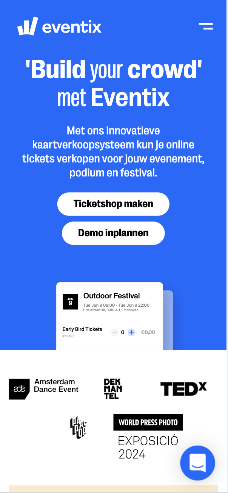
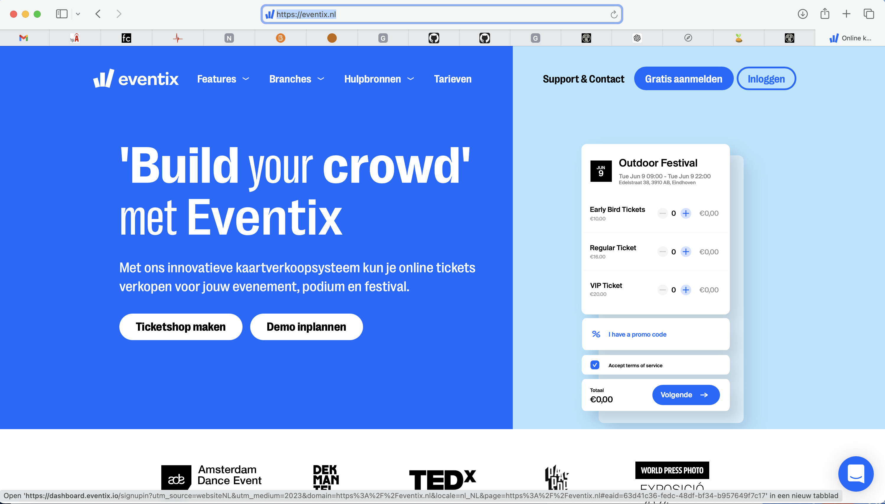
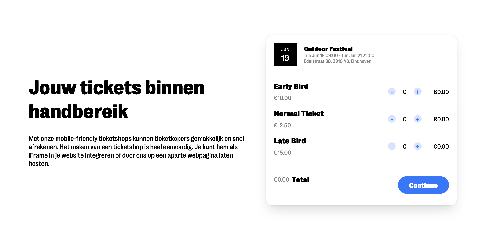
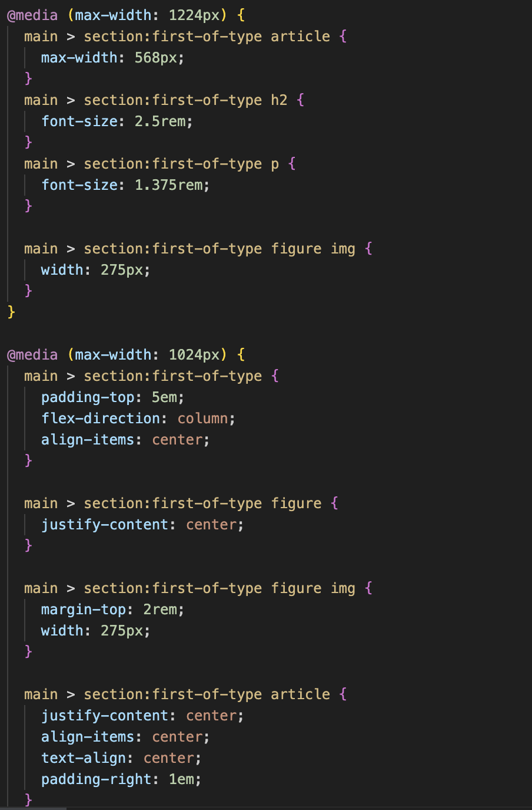
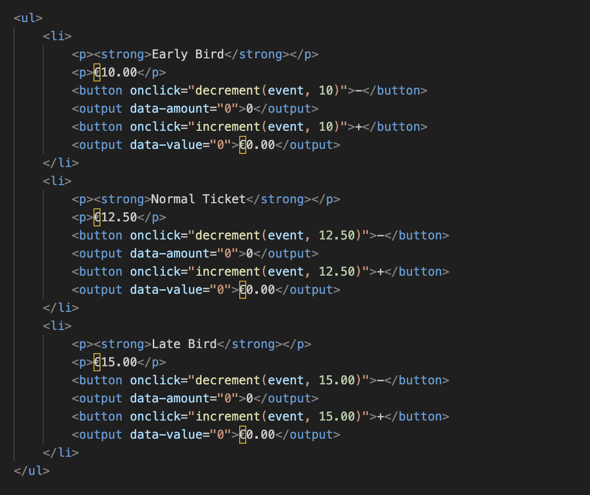

# Procesverslag
Markdown is een simpele manier om HTML te schrijven.  
Markdown cheat cheet: [Hulp bij het schrijven van Markdown](https://github.com/adam-p/markdown-here/wiki/Markdown-Cheatsheet).

Nb. De standaardstructuur en de spartaanse opmaak van de README.md zijn helemaal prima. Het gaat om de inhoud van je procesverslag. Besteedt de tijd voor pracht en praal aan je website.

Nb. Door *open* toe te voegen aan een *details* element kun je deze standaard open zetten. Fijn om dat steeds voor de relevante stuk(ken) te doen.

## Jij

  
uitwerken voor kick-off werkgroep

  ### Auteur:
  Sol Ballings

  #### Je startniveau:
Blauw
  #### Je focus:
Responsive 

## Je website

  
uitwerken voor kick-off werkgroep

  ### Je opdracht:
  https://eventix.nl

  #### Screenshot(s) van de eerste pagina (small screen): 
Eventix
  

  #### Screenshot(s) van de tweede pagina (small screen):
Eventix
  
 

## Toegankelijkheidstest 1/2 (week 1)

  
uitwerken na test in hoi 2e werkgroep

  ### Bevindingen
  Lijst met je bevindingen die in de test naar voren kwamen:

## Breakdownschets (week 1)

  
uitwerken na afloop 3e werkgroep

  ### de hele pagina: 
  

  ### dynamisch deel (bijv menu): 
  

  ### wellicht nog een dynamisch deel (bijv filter): 
  

## Voortgang 1 (week 2)

  
uitwerken voor 1e voortgang

  ### Stand van zaken
Ik vind de css toch nog erg lastig. Helaas was het downloaden van de foto's mislukt maar het is onderhand wel gelukt

  ### Agenda voor meeting
  samen met je groepje opstellen

  Ik wil graag kijken of mijn html klopt en of het begin wat ik heb gemaakt met css er correct uit ziet. 

  ### Verslag van meeting
  hier na afloop snel de uitkomsten van de meeting vastleggen

  - punt 1
  - punt 2
  - nog een punt
  - ...

## Voortgang 2 (week 3)

  
uitwerken voor 2e voortgang

  ### Stand van zaken
Ik ben net klaar met het afmaken van mijn HTML voor mijn eerste pagina, het lukt mij momenteel nog niet om de typografie te downloaden. Ik vind het lastig om de positionering goed te krijgen van de verschillende elementen in css. 

  ### Agenda voor meeting
  Ik was deze week ziek en ben niet bij de meeting geweest

  ### Verslag van meeting
  
- ...

## Toegankelijkheidstest 2/2 (week 4)

  
uitwerken na test in 9e werkgroep

  ### Bevindingen
Deze week ben ik bezig gegaan met het invoegen van wat toegangelijkheids elementen. Ik probeer er voor te zorgen dat mijn site goed te lezen is met een screenreader. Echter spreek ik bij de screenreaders qua gebruik niet bij eigen ervaring en is het daarom moeilijk om in te schatten of het goed genoeg is. 

## Voortgang 3 (week 4)

  
uitwerken voor 3e voortgang

  ### Stand van zaken
  hier dit ging goed & dit was lastig (neem ook screenshots op van delen van je website en code)

  ### Agenda voor meeting
 Ook deze meeting was individueel, en was dus ik niet met mijn groepje. Ik ben hier vooral bezig met het wegwerken van mijn Divjes, maar het lukt mijn niet om het interactieve element zonder divjes te maken. 

  ### Verslag van meeting
  Divjes omzetten in Section via uitleg van sanne in teams

## Eindgesprek (week 5)

  
uitwerken voor eindgesprek

  ### Je uitkomst - karakteristiek screenshots:
  

  ### Dit ging goed/Heb ik geleerd: 
  Korte omschrijving met plaatjes

  

  ### Dit was lastig/Is niet gelukt:
  Korte omschrijving met plaatjes

  

## Bronnenlijst

  
continu bijhouden terwijl je werkt

  1. Typografie en Webfonts
De code maakt gebruik van @font-face om een aangepaste lettertype "Grotesk" te laden, wat relevant is voor het personaliseren van de visuele stijl.
Bronnen:
MDN Web Docs: @font-face: Geeft een grondige uitleg over het implementeren van aangepaste lettertypes.
Google Fonts: Voor een breed aanbod aan open-source lettertypes.
2. Kleurenschema en Achtergrondkleur
De achtergrondkleuren zijn licht (voor de body #f4f6f9) en contrasten worden ingezet met primaire en secundaire kleuren (#006aff en #b3e5ff). Dit zorgt voor een frisse en professionele uitstraling.
Bronnen:
Coolors: Een handige tool voor het samenstellen van kleurenschema’s en kleurenpaletten.
Adobe Color: Voor het experimenteren met kleurencombinaties die goed bij elkaar passen.
3. Lay-out en Positionering
Flexbox wordt veelvuldig toegepast, bijvoorbeeld in header, main, en footer. De structuur lijkt ook responsief ontworpen, met media queries voor verschillende schermgroottes.
Bronnen:
CSS Tricks Flexbox Guide: Een uitgebreide gids over Flexbox, met praktische voorbeelden.
MDN Web Docs: CSS Flexible Box Layout: Officiële documentatie met uitleg over Flexbox eigenschappen.
4. Responsieve Web Design
Media queries voor schermen van 1224px, 1024px, en 768px zorgen voor een optimale weergave op verschillende schermgroottes.
Bronnen:
Responsive Web Design Basics (Google Developers): Basishandleiding over het ontwerpen van responsieve websites.
MDN Web Docs: Using Media Queries: Voor meer informatie over de verschillende media query-opties.
5. Button Styling en Interacties
De knoppen hebben subtiele hover-effecten, zoals schaduwen en overgangseffecten, wat bijdraagt aan de interactie en gebruiksvriendelijkheid.
Bronnen:
CSS Button Styling Guide: Praktische voorbeelden en stijltips voor knoppen.
Can I Use: CSS box-shadow: Voor compatibiliteit van box-shadow en andere CSS effecten.

